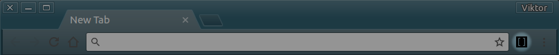

# Bracketless: Collapsible brackets

 

This extension makes text between brackets collapsible.

## Execution flow

Extension works via browser action (depicted above) or context menu (right click menu).

Executions order:

1. On first activation the extension loads. Matched text gets toggling functionality. After this step text can be folded and unfolded (by clicking on text between brackets).

1. On second action the extension plays. All matched text between brackets gets collapsed.

1. On third action the extension pauses. All matched brackets unfold and reveal text back.

1. After that the extension loops between play and pause.

## Features

+ No permissions required
+ Options page
  + Minimal and maximal brackets matching limits
  + Automation

## Installation

### Or manually

1. Download or `git clone https://github.com/mrv1k/bracketless.git`
1. Open Chrome extensions and toggle on `Developer mode` mode
1. Inside bracketless folder, find "core" folder and drag and drop it inside Chrome window

### Postmortem

Is available [here on GitHub](./media/postmortem.md)

### Credits

 icon made by Freepik
