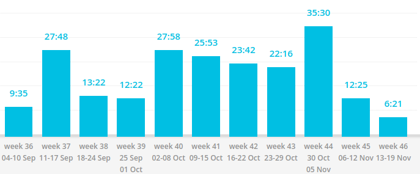

# Postmortem

_Decision to write my first project was the best decision I've ever made._

## Table of Contents

+ Motivation
  + Deadlines
  + Habits
+ Self education
  + Tutorials
  + Books
+ Planning
  + Without a plan
  + With a plan
+ Tools
  + Searching
  + Toggl
+ First project specific
  + The first version
  + Experimenting
  + Overengineering
+ Other
  + Working alone
  + All or nothing mindset
  + Toggl stats

---

## Content layout

1. Preface
1. The good
1. The bad
1. Conclusion

---

## Motivation

### Deadlines

1. Initial deadline was to finish the extension in 3 days. It (obviously) didn't work, even the first implementation took 6 days to complete. 3 more self-set deadlines followed and failed. The logic behind deadlines was to get shit done.

1. **Deadlines are good**, they helped me to stay motivated.

1. Tasks grew more complex. I realized that (setting and failing) deadlines were doing more harm than good, so I stopped. No deadlines. I was taking my time to finish the extension. Publish it when its ready. **Self-set deadlines alone can't keep motivating**

1. As the project progressed, I got better at estimating how long a feature will take, however, because it's a self owned project I had the luxury to keep it deadlines free. At that point, I was enjoying the coding process and didn't need deadlines anymore.

p.s.: The extension was released on November 9, 2017. 58 days after I created the repo.

### Habits

1. When I started writing the extension, I knew I needed to build a habit of coding daily. I failed my first attempt but the failure reinforced the importance of making it a habit.

1. Making it a habit allowed me to drop deadlines as it **kept me going** (especially when I didn't want to do anything).

1. **Nothing** bad unless abuse it. (Don't start smoking, alright?)

1. The habit helps me move forward, even after the project is over.

## Self education

### Tutorials

1. Tutorials helped to be a bit more ready for the first project, at least they made me confident. Nonetheless, it was a short ride. Soon, I was searching everything but the basics.

1. **I knew what and where to search**.

1. Tutorials **only familiarize with the subject**. Tutorials did NOT help me learn it.

1. In 4 years of self education, not a single tutorial was able to teach me what I learned by doing a project.

### Books

+ Reading the book series "[You Don't Know JavaScript](https://github.com/getify/You-Dont-Know-JS)" by [getify](https://github.com/getify) helped me the most with this project. (To be fair, the series taught me JavaScript altogether)

## Planning

### Without a plan

1. I started this project only having a concept, no planning involved. It's a bad idea, unless, it your first project, which was the case. In that case you can go ahead because you don't know what you're doing anyway :laughing:

1. Okay, I'm lying, **the concept itself is a generalized plan**. **It was enough for the first working version**.

1. Only **the idea was not enough to see the whole picture** which cost me later in development. Particularly, from versions 0.5 to 0.6. (I had to rewrite the internal state managing which lead to a huge domino effect.)

1. Planning is hard. It impossible without experience. You cannot reasonably plan what you don't know.

### With a plan

1. Plan is a must for any project.

1. Besides the usual, **plans helped me drop the question of what to do next**.

1. **Over-planning is a thing**, I've experienced it firsthand. One of my plans was a disaster. It was a big plan with lots of points, I assumed everything to work as expected but it didn't. That led to a the domino effect and the plan fell apart. It's important to **have a plan for major & minor features without going in too deep**.

1. What worked for me was the balance between the main plan for major & minor features and small daily plans. It's essential to keep daily plans small so that they are achievable within a day.

## Tools

### Searching

1. It's not coding that you'll be doing the most.

1. **Early development**. I was **looking for ready solutions** on stackoverflow (_totally not to copypaste_). It was **easy to find and they worked**.

1. **Middle development**. I was **not looking for ready solutions** anymore, the challenges were too specific. **Stackoverflow's usefulness foreseeable decreased**. The unexpected was that chances of finding something useful plummeted. (Welcome to  2017, I'm complaining about SO like it's a wiki and not Q&A forum)

1. Middle/Late development. As stackoverflow's usefulness decreased, Chrome Extensions API documentation's helpfulness increased. As you get to know the tools, middle step between you and a solution becomes unnecessary. You know where to go, just do it.

p.s.: I want to express gratitude to a stackoverflow user - [Xan](https://stackoverflow.com/users/934239/xan). He clarified a lot of my API misunderstanding.

Fun fact: MDN extensions docs are better than google's.

### Toggl

1. Git tracks code progress. Toggl tracks time.
1. I started development, it went easy and I was coding. It got hard and boom, I was bombarded by self-doubting questions. %open\_toggl% %check\_time\_progress% If there's time, there's progress. Huh, okay. %coding%
1. Don't cheat.
1. Starting is easy, finishing is hard. Toggl helps to finish. Use it.

## First project specific

### The first version

1. The first is the scariest. I questioned my abilities a lot. _Would I be able to make it through? What if I fail?_ The questions were full of self doubt.

1. It's important to get main functionality ready as soon as possible so you can test the idea. Bracketless idea has met the expectations. It was doing what I expected even though it was very buggy.

1. While developing the first version of the first project I made a lot of logic mistakes and that cost me later in development as I had to refactor everything.

1. It is scary to start the first project, but just close your eyes and do it. Nothing bad can happen. What is the worst case scenario that could happen? Project failure? The amount of new knowledge that you gain will easily patch that wound. Always consider what will happen if you don't start it - nothing. _If you change nothing, nothing will change._

### Experimenting

1. Experiment. Personal project is the place to do it.

1. It's easier to make right decision. e.g.: I learned why _querySelectorAll_ is better than _getElementsByTagName_ (TreeWalker to rule them all).

1. It requires extra time, and likely to cause mess.

1. So many options. How do you choose between similar libraries A and B? A over B? B over A? Try both and see for yourself, which one makes more sense? Use it.

### Overengineering

1. Overengineering is bad, m'kay? It's unnecessary complexity that adds mental tax. It should be avoided.

1. I overengineered the extension. Primarily, to make it exactly like I envisioned it, a part just to practice and learn even more. I definitely didn't need state management complexity. I don't regret it, it forced me to think about things I've never considered before.

1. Time is the price. I've spent 2 extra weeks doing what would be a simple "background" extension, an "event page" extension.

1. It's okay to overengineer your **own** projects for the sake of learning. It's important to keep it for learning only, otherwise it's just unnecessary complexity.

## Other

### Working alone

1. I am a pretty people independent person and I expected it to reflect in development. Not exactly the case.

1. **Single responsibility**, I avoided organizational overhead and had easy time making changing on the fly.

1. A few actually:

    + **Full responsibility**. My project, I own it. I don't like CSS, well nobody would do that for me, so I just suffered through. Quality is the currency.
    + **Avoidance**. Happened to me a couple times. I knew what to do, I knew it would be difficult and still I delayed the completion until I had to do it. The end result was the same, I found myself doing that task later anyway.
    + **Hard tasks**. There was a particularly hard problem that took me 4 back to back iterations and 10 hours to solve, just to arrive at the beginning but with a new perspective. Solution worked as expected, but I had to talk someone. I had to bitch about the difficulty.

1. Working alone has its benefits but limitations are plenty. There's a constant pressure that you're the only one who can do it. It is hard but manageable. Be ready to do everything.

> Alone we can do so little; together we can do so much.
> -- _Helen Keller_

### All or nothing mindset

1. Close to the end of development, I got this mindset that based on how much time I've spent developing this extension I might as well take extra time and not rush it.

1. It's a good thing to take extra time and polish the project.

1. It's a dangerous mindset as it eliminates time from the development equation. The most precious thing that I have.

1. I think this mindset tolerable as long as you strictly **strictly** limit this time. I didn't limit the time which lead me to start procrastinating. Being an experienced procrastinator I realized it relatively quickly and immediately ended this mindset and published the extension. (That's why I have published version 0.7.2 instead of planned 1.0)

### Toggl Stats

The tool helped that allowed me become a developer.

| Action/tag   | Hours |
| -----------  | :---: |
| js           | 177   |
| html/css     | 2     |
| js, html/css | 11    |
| design       | 14    |
| publishing   | 4     |
| postmortem   | 8     |
| total        | 217   |

Detailed report:

It was a hell of a ride.
