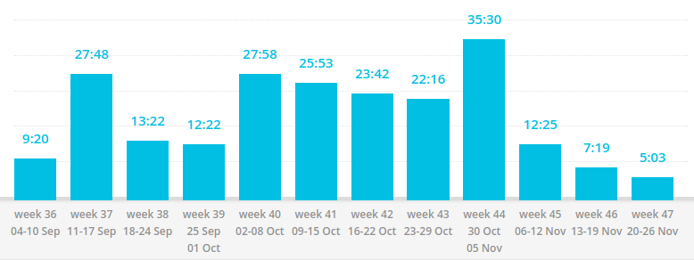

# Postmortem

_The decision to write my first project was the best decision I've ever made._

---

## Content layout

It's a weird style for a postmortem as there's good and bad for every section.

1. Preface
1. The good
1. The bad
1. Conclusion

---

## Table of Contents

+ [Motivation](#motivation)
  + [Deadlines](#deadlines)
  + [Habits](#habits)
+ [Self-education](#self-education)
  + [Tutorials](#tutorials)
  + [Books](#books)
+ [Planning](#planning)
  + [Without a plan](#without-a-plan)
  + [With a plan](#with-a-plan)
+ [Tools](#tools)
  + [Searching](#searching)
  + [Toggl](#toggl)
+ [First project specific](#first-project-specific)
  + [The first version](#the-first-version)
  + [Experimenting](#experimenting)
  + [Over-engineering](#over-engineering)
+ [Other](#other)
  + [Working alone](#working-alone)
  + [All-in](#all-in)

[Toggl stats](#toggl-stats)

---

## Motivation

### Deadlines

1. The initial deadline was to finish the extension in 3 days. It (obviously) didn't work, even the first implementation took 6 days to complete. 3 more self-set deadlines followed and failed. The logic behind deadlines was to get shit done.

1. **Deadlines are good**, they helped me to stay motivated.

1. Tasks grew more complex. I realized that (setting and failing) deadlines were doing more harm than good, so I stopped. No deadlines. I was taking my time to finish the extension. Publish it when its ready. **Self-set deadlines alone can't keep motivating**

1. As the project progressed, I got better at estimating how long a feature will take, however, because it's a self-owned project I had the luxury to keep it deadlines free. At that point, I was enjoying the coding process and didn't need deadlines anymore.

p.s.: The extension was released on November 9, 2017. 58 days after I created the repo.

### Habits

1. When I started writing the extension, I knew I needed to build a habit of coding daily. I failed my first attempt but the failure reinforced the importance of making it a habit.

1. Making it a habit allowed me to drop deadlines as it **kept me going** (especially when I didn't want to do anything).

1. **Nothing** bad unless abuse it. (Don't start smoking, alright?)

1. The habit helps me move forward, even after the project is over.

## Self-education

### Tutorials

1. Tutorials helped to be a bit more ready for the first project, at least they made me confident. Nonetheless, it was a short ride. Soon, I was searching everything but the basics.

1. **I knew what and where to search**.

1. Tutorials **only familiarize with the subject**. Tutorials did NOT help me learn it.

1. In 4 years of self-education, not a single tutorial was able to teach me what I learned by doing a project.

### Books

+ Reading the book series "[You Don't Know JavaScript](https://github.com/getify/You-Dont-Know-JS)" by [getify](https://github.com/getify) helped me the most with this project. (To be fair, the series taught me JavaScript altogether)

## Planning

### Without a plan

1. I started this project only having the idea, no planning involved. It's a bad decision, unless, it is your first project, which was the case. In that case, you can go ahead because you don't know what you're doing anyway :laughing:

1. Okay, I'm lying, **the idea itself is a generalized plan**. **It was enough for the first working version**.

1. Only **the idea was not enough to see the whole picture** which cost me later in development. Particularly, from versions 0.5 to 0.6. (I had to rewrite the internal state managing which led to a huge domino effect.)

1. Planning is hard. It impossible without experience. You cannot reasonably plan what you don't know.

### With a plan

1. A plan is a must for any project.

1. Besides the usual, **plans helped me drop the question of what to do next**.

1. **Over-planning is a thing**, I've experienced it firsthand. One of my plans was a disaster. It was a big plan with lots of points, I assumed everything to work as expected but it didn't. That led to a domino effect and the plan fell apart. It's important to **have a plan for major & minor features without going in too deep**.

1. What worked for me was the balance between the main plan for major & minor features and small daily plans. It's essential to keep daily plans small so that they are achievable within a day.

## Tools

### Searching

1. It's not coding that you'll be doing the most.

1. **Early development**. I was **looking for ready solutions** on stackoverflow (_totally not to copypaste_). It was **easy to find and they worked**.

1. **Middle development**. I was **not looking for ready solutions** anymore, the challenges were too specific. **Stackoverflow's usefulness foreseeable decreased**. The unexpected was that chances of finding something useful plummeted. (Welcome to  2017, I'm complaining about SO like it's a wiki and not Q&A forum)

1. Middle/Late development. As stackoverflow's usefulness decreased, Chrome Extensions API documentation's helpfulness increased. As you get to know the tools, a middle step between you and a solution becomes unnecessary. You know where to go, just do it.

p.s.: I want to express gratitude to a stackoverflow user - [Xan](https://stackoverflow.com/users/934239/xan). He clarified a lot of my API misunderstanding.

Fun fact: MDN extensions docs are better than google's.

### Toggl

1. Github tracks code. Toggl tracks time.

1. When I started the project, the development process was going smooth. As time went on, the process got more complex and boom! (After a few consequent mistakes) I found myself bombarded by self-doubt questions. Took a deep breath. Opened toggl. Erased the self-doubt. **If there's time, there's progress**.

1. **Don't cheat**.

1. It's hard to finish. Toggl helps to finish. Use it.

## First project specific

### The first version

1. The first _anything_ is the scariest. I questioned my coding skills a lot.

1. It's impractical to test an idea, that's why it's crucial to get the first version ready ASAP. Bracketless idea has met the expectations. It was doing what I expected (even though it was buggy). **Don't trust an idea, test the idea**.

1. The first version of the first project doesn't sound right without **mistakes**. **I made a lot of them, and that's okay**. It would be crazy expect not to make any.

1. Starting is scary. Still, you have to do it. What is the worst case scenario that could possibly happen? A failure? Ha! The knowledge you obtain will easily patch that wound. What will happen if you don't start it? Nothing.

> If you change nothing, nothing will change.
> -- _Unknown_

### Experimenting

1. Experiment. The personal project is the place to do it.

1. I learned why _querySelectorAll_ is better than _getElementsByTagName_. **Experimenting helped to make a logical decision**.

1. **It requires extra time, and likely to cause a mess**.

1. So many options. How to choose between similar libraries A and B? A over B? B over A? Try both and see for yourself.

### Over-engineering

1. Over-engineering is bad, m'kay? It's unnecessary complexity that adds mental tax. **Over-engineering should be avoided**.

1. I admit, I over-engineered the extension. I had to, to make it exactly like I envisioned. I definitely didn't need all that state management complexity. I don't regret it. Managing state **forced me to think about things I've never even considered before**.

1. **Time is the price**. I've spent 2 weeks doing what would be a simple "background" extension, an "event page" extension.

1. It's tolerable to over-engineer your own projects for the sake of learning. It's important to keep it for learning only.

## Other

### Working alone

1. I don't rely on anyone and I expected it to reflect in development. Not exactly the case.

1. **Single responsibility**, no organizational overhead and easy time making changes on the fly.

1. A few actually:

    + **Full responsibility**. I don't like CSS, well nobody would do that for me, so I just did it. Quality suffered, but it was done.
    + **Avoidance**. Happened to me a couple times. I knew what to do, knew it would be difficult. Still, I delayed the completion. The end result was the same, I found myself doing that task anyway.
    + **Challenging tasks**. There was a particularly challenging problem that took me 4 back to back iterations and 10 hours to solve. Final solution led me to the initial code but with a new perspective. The solution worked as planned, but I had to talk someone, had to share the experience. Sharing eased the pain.

1. Working alone has its benefits but limitations are plenty. There's a constant pressure that you're the only one who can do it. It is hard but manageable.

> Alone we can do so little; together we can do so much.
> -- _Helen Keller_

### All-in

1. Late in development, I got this all-in mindset. "I spent that much might as well take my time and not rush it." A decent idea, my bad execution.

1. It's good to take **extra time to polish the project**.

1. **A treacherous mindset that eliminates time from the development equation**.

1. The mindset is bearable as long as you **strictly** limit its duration. I didn't. I started procrastinating. Toggl hours went down, that raised the procrastination alarm. I promptly wrapped the development and published the extension. (That's why I've published version 0.7.2 instead of planned 1.0)

Thanks for reading.

## Toggl Stats

The tool that helped me become a developer.

| Action/tag   | Hours |
| -----------  | :---: |
| js           | 177   |
| html/css     | 5     |
| js, html/css | 11    |
| design       | 14    |
| publishing   | 4     |
| postmortem   | 12    |
| total        | 223   |

Detailed report:

